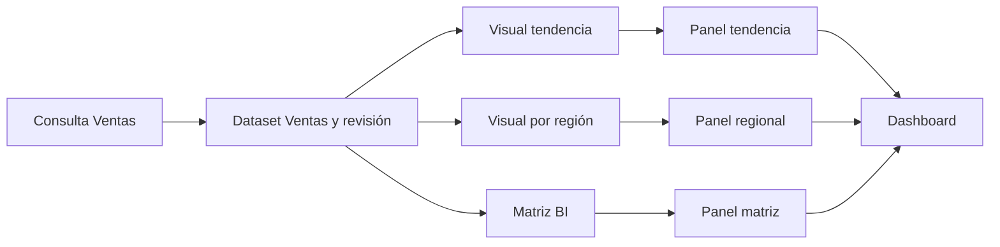

# Mapa vivo del dashboard

**Fecha:** 2026-10-08. **Estado:** diseño pendiente de implementación.
Vista de dependencias reales durante la autoría, vinculada al
[recorrido multiconsulta](sqlviz-visual-authoring-decision.md#del-editor-multiconsulta-a-campos-reutilizables).
No sustituye el lienzo ni habilita un editor de pipelines ETL.

## Experiencia

Ofrecer «Mapa» en las acciones del dashboard para abrir una vista temporal del
área de trabajo. El lienzo conserva selección, posición y borradores al volver.
No añadir un sidebar permanente ni otra barra ocupando altura del dashboard.
Los lectores acceden solo si la publicación permite esa vista y su contenido.

El mapa muestra objetos existentes y sus referencias, por ejemplo:

Crear un visual agrega su nodo/enlaces; reutilizar un dataset conserva un único
nodo de definición. Borrar una instancia retira ese panel, no su visual compartida.
Renombrar actualiza etiquetas, no identidad. Mover un panel cambia geometría,
no dependencia. El orden de sentencias separadas por `;` no define las aristas.

Seleccionar un nodo resalta sus entradas/salidas y abre contexto: consulta,
campos, revisión, visual o ubicación del panel. «Ir al objeto» enfoca el editor,
builder o panel correspondiente, con regreso al mapa y recuperación de foco.
Un visual con varios inputs muestra esas referencias por nombre/ID.

Estados discretos y con texto: confirmado, cambio pendiente, actualizando,
ejecución fallida o referencia/campo incompatible. Distinguir definición guardada
de último resultado disponible; no llamar «actualizado» a un dataset solo porque
se guardó SQL. Los detalles de campos/linaje se revelan al seleccionar; no mostrar
todos los campos de todos los datasets desde el primer render.

## Fuente de verdad y arquitectura

Derivar el grafo de los contratos reales de consulta/dataset/visual/panel y sus
revisiones. El mapa es una proyección de lectura, no otro repositorio de
dependencias editable. Consulta/dataset pueden aparecer agrupados para reducir
ruido, conservando la distinción en el inspector.

Separar relaciones **declaradas** —bindings y referencias persistidas— del linaje
**analizado** de columnas mediante SQLGlot. Una relación inferida incompleta se
identifica como tal; no fabricar tablas, datasets o enlaces con nombres parecidos.
Si un objeto legacy guarda SQL dentro del panel, representarlo como consulta
inline/legacy, sin fingir que ya existe un dataset reutilizable separado.

Aplicación expone metadata autorizada y revisión coherente. Web proyecta objetos
por ID, incorpora eventos/confirmaciones ya disponibles y descarta generaciones
de un dashboard abandonado. Cambios pendientes pueden superponerse al confirmado
con estado explícito; un rechazo no publica esas referencias como guardadas.
Abrir, explorar o distribuir el mapa no ejecuta SQL ni altera el layout del lienzo.

No conservar un segundo SQL canónico, copiar filas al grafo ni guardar conexiones
dibujadas a mano que contradigan los bindings. Zoom/posición/agrupación del mapa
son preferencias privadas. Su layout automático debe conservar foco y posición
durante actualizaciones; no recolocar todos los nodos por cada movimiento del mouse.

La primera vista ya necesita límites de nodos/aristas, navegación por teclado y
alternativa en lista. Ante un grafo grande, ofrecer contexto del objeto seleccionado
y carga acotada; no montar todo el proyecto ni anunciar relaciones completas si
solo se recibió una parte. Medir layout, render y actualización por separado.

El servidor limita la proyección al alcance autorizado. Compartir un dashboard
no revela SQL, tablas, credenciales, columnas o dashboards vecinos por transitividad.
Detalles de SQL/linaje requieren el permiso correspondiente; no confiar en ocultar
nodos solo mediante CSS. Las revisiones publicadas fijan el mapa estructural de
esa publicación; estados de ejecución/frescura se presentan por separado.

## Entregas pequeñas

| Parte | Integración | Cierre |
| --- | --- | --- |
| F1 | S3.6 | Proyección tipada por IDs/revisiones, nodos/enlaces reales, scope y referencia inválida; pruebas independientes del renderer |
| F2 | S4.6a | Vista bajo demanda, selección, contexto/ir al objeto, teclado y alternativa en lista; mismo alcance que el dashboard, límites explícitos |
| F3 | S4.6b | Actualización al crear/reutilizar/editar/borrar; confirmado frente a draft, rollback, respuestas tardías y reapertura |
| F4 | S5 | Linaje de campos con evidencia; diagnóstico de impacto al modificar esquema; precisión/cobertura del AST visibles |
| F5 | S8 | Revisión publicada y permiso de lectura; accesibilidad, agrupación/carga acotada y rendimiento medido |

F1/F2 comienzan con las relaciones del modelo, sin exigir el AST profundo de S5.
No adelantan S1.1b ni la separación mínima S3. Una estructura todavía incompleta
se muestra con sus límites, sin convertir un diagrama de documentación en prueba
de dependencias reales. La UI sigue pendiente tras esta especificación.

Validar reutilización de un dataset por tres visuales y de una visual por varios
paneles; consultas/series permutadas; renombrado/borrado; cambio de esquema;
fallo/concurrencia; estados tras filtros y refresh; foco/teclado/lista equivalente;
zoom y grafos grandes; ausencia de fugas entre autor y enlaces de lectura.
