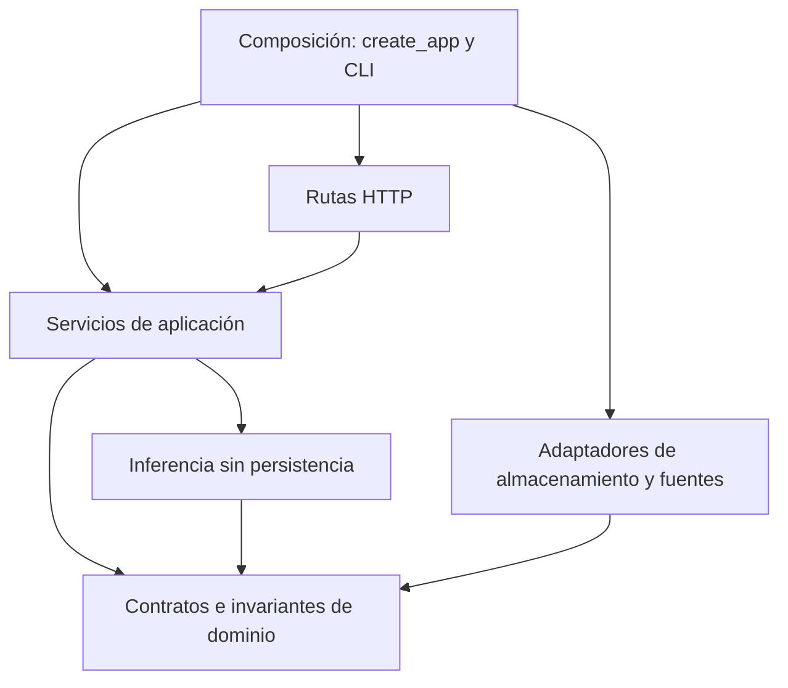

# Evaluación de buenas prácticas de arquitectura

**Fecha:** 2026-10-05. **Base:** `7f59429` y revisión documental de esta sesión.
**Estado:** evaluación y criterios para implementar; no anuncia correcciones de
código. Complementa la [auditoría](sqlviz-audit-2026-10-05.md) y la
[arquitectura objetivo](sqlviz-product-architecture.md).

**Seguimiento — 2026-10-06:** autorización y ejecución analítica ya tienen
servicios por aplicación sin importar FastAPI. El [QueryService inicial](sqlviz-analytical-execution.md)
centraliza aislamiento y presupuestos; sigue usando un adaptador DuckDB concreto.
La matriz inferior conserva la evaluación de la base auditada. BP-01 y BP-02
tienen corrección posterior; BP-03 también está corregido y BP-05 para ubicación.
**Seguimiento — 2026-10-07:** BP-04 tiene corrección local mediante el
[contrato tipado de composición](sqlviz-composition-contract.md).
El [PATCH de dashboards](sqlviz-dashboard-patch.md) también valida campos en core
y HTTP, distingue omisión/null y confirma campos/ubicación en una transacción.
El [PATCH básico de paneles](sqlviz-panel-patch.md) valida nombre/SQL/orden y los
actualiza de forma atómica; los borrados participan en la protección de la fila.
Presentación, revisión de overrides y contratos de adaptadores siguen pendientes.

La [cuarta unidad de E0](sqlviz-parameters-and-quality.md) mueve validación de
valores a core y planificación de filtros a un servicio sin FastAPI; usa AST
para placeholders/listas y limita cuerpos antes de JSON. Checks globales de
tipos y svelte-check limpios. La [primera unidad de E1](sqlviz-dashboard-integrity.md)
corrige BP-01: repositorio con transacción, servicio de revocación después del
commit y creación dependiente protegida frente a borrado simultáneo. Incluye
25 casos nuevos de regresión. La [segunda unidad de E1](sqlviz-folder-integrity.md)
incorpora política de jerarquía pura en core, repositorio de carpetas, revisión
del árbol y PATCH/null de ubicación en carpetas/dashboards. No añade un servicio
que repita el repositorio. La [tercera unidad de E1](sqlviz-panel-dimensions.md)
lleva los rangos manuales a core, valida antes de escribir y confirma tamaños
en UI. El aprendizaje opcional tiene su propia transacción de patrón/evento.
La primera parte de la unidad 8 valida composición en HTTP, conserva el resultado
original y entrega dataclasses al motor. El segundo incremento lleva PATCH de
dashboards al repositorio transaccional, sin añadir capas que repitan la operación.
El tercero lleva campos básicos del panel al repositorio y prueba edición/borrado
concurrentes sin serializar paneles distintos. Siguiente: presentación y overrides.

## 1. Dictamen

La elección de un monolito modular es adecuada para la etapa del producto. La
separación en paquetes, los modelos explícitos y las pruebas son fortalezas.
Sin embargo, la modularidad actual es parcial: varias reglas dependen de la UI,
las rutas HTTP concentran casos de uso y el procesamiento analítico conoce la
persistencia. Tener seis paquetes no garantiza seis límites independientes.

La prioridad de diseño es hacer verificables las propiedades del sistema:
quién puede hacer qué, qué datos son válidos, qué cambios son atómicos, qué ocurre
cuando falla una dependencia y cuánto trabajo puede aceptar el proceso.
Aplicar patrones solo cuando ayudan a asegurar esas propiedades.

## 2. Matriz de evaluación

| Práctica | Evaluación actual | Evidencia y decisión |
| --- | --- | --- |
| Modularidad y cohesión | Parcial | Paquetes por responsabilidad; `routers/panels.py` mezcla consulta, inferencia, aprendizaje y persistencia. Extraer casos de uso |
| Dirección de dependencias | Parcial | Storage importa un contrato de inference sin declararlo como dependencia. Llevar el contrato compartido a core o entregar valores independientes |
| Responsabilidad única (SRP) | Débil en puntos centrales | Store principal de frontend y router de paneles tienen múltiples razones para cambiar. Separar por flujo y estado, no por número de líneas |
| Extensión de fuentes (OCP) | Preparación sin integración | `DataSourceContract` existe, pero la API llama a DuckDB directamente. Integrar primero un adaptador real |
| Sustituibilidad (LSP) | No demostrada | No hay evidencia de dos adaptadores productivos usados por QueryService con los mismos comportamientos. Exigir pruebas de contrato al añadir el segundo |
| Interfaces pequeñas (ISP) | Base razonable | Protocolos cortos. Revisar capacidades opcionales por casos reales; no crear interfaces de un método automáticamente |
| Inversión de dependencias (DIP) | Incompleta | Inference recibe `brain_conn: Any` y ejecuta SQL. Inyectar preferencias y sacar persistencia del compilador |
| Encapsulación de invariantes | Insuficiente | API acepta ancho negativo y ciclos de carpetas; borrado deja paneles huérfanos. Validación de dominio en servidor |
| Transacciones e integridad | Inconsistente | Borrar carpeta sí usa begin/commit/rollback; migraciones y cambios entre proyecto/brain no comparten esa garantía |
| Contratos y validación | Parcial | Pydantic en HTTP y versiones de specs son positivos; composición admite diccionario sin validar y puede devolver 500 ante entrada inválida |
| Concurrencia y recursos | Insuficiente para equipo | Cursores por request sin cierre explícito, brain y sesiones globales, ausencia de revisión condicional al editar |
| Errores y observabilidad | Parcial | Trace y tiempos del pipeline; errores de filtros pueden dejar datos previos sin avisar. Correlacionar solicitud, consulta e inferencia |
| Separación de estado frontend | Parcial | Existen stores por dominio, pero el principal orquesta CRUD, ejecución, filtros, caché y apariencia |
| Pruebas de arquitectura | Pendiente | Suites funcionales abundantes; no se observa un gate de dependencias ni cobertura suficiente de invariantes y límites de acceso |
| Simplicidad (KISS/YAGNI) | Stack adecuado; roadmap anterior excesivo | Mantener monolito y pocos límites reales. Condicionar motores adicionales a beneficio medido |

Esta matriz no asigna una nota numérica: no existe una métrica objetiva que
permita convertir estos hallazgos en «8/10 de arquitectura».

## 3. Hallazgos adicionales reproducidos

Ensayo con TestClient, proyecto y brain en memoria, `demo_mode=True` para evaluar
el dominio independientemente del problema de autorización. Se sustituyó
`get_brain_connection`; no se abrieron datos personales ni servicios de red.

| ID | Operación | Resultado observado | Invariante requerido |
| --- | --- | --- | --- |
| BP-01 | Crear dashboard y panel; borrar dashboard | DELETE 204; queda 1 panel; GET del panel devuelve 200 | El panel debe pertenecer a un dashboard existente o a un estado archivado explícito |
| BP-02 | Actualizar una carpeta con `parent_id` igual a su ID | PATCH 200; ciclo persistido | Una jerarquía de carpetas debe ser acíclica y referir padres existentes |
| BP-03 | Aplicar override `col_span = -7` | PATCH 200; `-7` persistido | Ancho dentro del rango soportado (actualmente 1–12) |
| BP-04 | Componer con `inference_result: {}` | HTTP 500 | Entrada inválida rechazada con error de validación 4xx, sin excepción interna |
| BP-05 | Enviar `parent_id: null` para quitar el padre | PATCH 200; padre sigue igual | Diferenciar omisión, valor nuevo y borrado explícito en actualizaciones |

Evidencias en código de la base auditada (los seguimientos describen las correcciones):

- [Borrado de dashboard](../../packages/sqlviz-api/src/sqlviz_api/routers/dashboards.py):
  `delete_dashboard` eliminaba únicamente la fila del dashboard. Ahora delega
  en el servicio y [repositorio transaccional](../../packages/sqlviz-storage/src/sqlviz_storage/dashboard_repository.py).
- [Carpetas](../../packages/sqlviz-api/src/sqlviz_api/routers/folders.py):
  `update_folder` escribía el padre sin verificar ciclos e ignoraba `None`.
  Ahora conserva la presencia del campo y delega en el repositorio transaccional.
- [Overrides](../../packages/sqlviz-storage/src/sqlviz_storage/override_system.py):
  `apply_override` convierte ancho/alto a entero sin validar su rango.
- [Composición](../../packages/sqlviz-api/src/sqlviz_api/routers/compose.py):
  `ComposeItem` admitía `dict[str, Any]` y construía `InferenceResult(**...)`
  sin validación completa en la frontera. Ahora usa el contrato tipado de BP-04;
  entrada inválida devuelve 422 antes del motor, con límites y compatibilidad probados.

BP-01–05 son P1 y se incorporan a E1. Los riesgos P0 de autorización documentados
anteriormente conservan prioridad. Estos ensayos no son una prueba de carga ni
una suite permanente de regresión: al corregir cada caso se debe añadir su test.

## 4. Dependencias reales y dirección objetivo

Una inspección AST de imports Python, incluyendo imports diferidos y bajo
`TYPE_CHECKING`, encontró estas relaciones entre paquetes:

```text
api       -> core, inference, storage
cli       -> api, core, storage
inference -> core
storage   -> core, inference
```

Esto no demuestra un ciclo de imports Python entre paquetes. Sí demuestra una
dependencia storage → inference: `_log_event` importa `FeedbackEvent` en tiempo
de ejecución, mientras `sqlviz-storage/pyproject.toml` no declara inference.
El workspace puede ocultar ese defecto de instalación independiente.

Además existe acoplamiento que un grafo de imports no detecta: `FeedbackEngine`
conoce tablas y ejecuta SQL a través de `brain_conn`. Cambiar el esquema del
aprendizaje puede obligar a cambiar el motor aunque no importe storage.

Dirección objetivo de imports, dentro del monolito:



Los servicios reciben dependencias por constructor o parámetros. Las rutas
traducen HTTP a un caso de uso; el dominio no importa FastAPI. El ensamblado es
el lugar que elige DuckDB y crea recursos. Las interfaces compartidas residen
en el módulo de dominio que las necesita, dentro de core cuando varios paquetes
deben importarlas; evitar que core se convierta en un contenedor de utilidades.

No hace falta un contenedor de inyección ni crear nuevos paquetes para cada capa.
`api/services/` puede alojar inicialmente la aplicación sin importar HTTP en sus
módulos. El nombre físico del paquete no debe impedir probar un caso de uso
sin iniciar FastAPI.

La separación lógica en capas es compatible con desplegar una sola aplicación;
esa distinción también aparece en la guía de
[arquitecturas web de Microsoft](https://learn.microsoft.com/en-us/dotnet/standard/modern-web-apps-azure-architecture/common-web-application-architectures).
Se toma el principio, no su stack .NET.

## 5. Invariantes, transacciones y efectos secundarios

Reglas iniciales a implementar una sola vez en backend, compartidas por UI,
API, importaciones y futuros trabajos programados:

- Un panel referencia un dashboard válido. Borrar el dashboard elimina sus
  paneles/datos de filtro y revoca sus shares en una transacción, o se introduce
  una política explícita de archivo. Preservar auditoría según su propia retención.
- Una carpeta no puede ser su propio padre ni descendiente de sí misma; validar
  existencia y ámbito del padre. Una clave foránea por sí sola no impide ciclos.
- Chart type, dimensiones y campos son compatibles con el esquema. La UI puede
  facilitar la validación, pero el servidor es la autoridad.
- El estado publicado referencia una revisión completa; ejecutar o guardar
  parcialmente no debe convertir un borrador incoherente en publicación.
- Los campos de ejecución autoritativos (resultado, instante y SQL ejecutado)
  los produce el servidor. Actualmente `DashboardUpdate` los acepta del cliente.

Usar constraints de la base cuando encajen con el motor y complementar con
invariantes de aplicación. Antes de añadirlas a proyectos existentes, detectar
datos inválidos, definir reparación y probar migraciones sobre copias.

La unidad de transacción coincide con el caso de uso que debe ser atómico.
`delete_folder` ya proporciona un ejemplo local positivo. Evitar mantener
bloqueos de metadatos durante una consulta analítica larga: ejecutar contra una
revisión y confirmar después solo si continúa siendo válida.

En la base auditada, `apply_override` actualiza el proyecto y después brain; un
fallo del segundo paso puede dejar el proyecto guardado y devolver un error.
La tercera unidad de E1 implementa la decisión de guardar el override como
fuente de verdad y aprender como efecto secundario opcional. El fallo secundario
se registra sin fingir que el guardado se deshizo; patrón/evento se revierten
juntos en su propia transacción. No hay atomicidad entre archivos ni reintentos.
Si se requiere entrega garantizada del evento, usar una tabla de eventos
pendientes en la misma transacción y reintentos idempotentes. No introducir
transacciones distribuidas ni un broker solo para este caso.

## 6. Contratos que representen el dominio

Mantener Pydantic en HTTP y tipos de dominio independientes es una buena base.
Completar restricciones y traducción de errores:

- Sustituir strings genéricos por enums/uniones y límites donde haya un conjunto
  conocido de valores. Validar tamaños de cuerpos y listas antes de ejecutar.
- Diferenciar campo omitido y `null` explícito. Versionar/documentar la transición
  desde los sentinelas actuales; no cambiar clientes silenciosamente.
- Validar composición y visual specs anidadas. Versionar entrada/salida y probar
  compatibilidad con archivos/fixtures de versiones anteriores.
- Un `as Promise<T>` de TypeScript no valida el JSON recibido. Generar tipos
  desde contratos y validar fronteras relevantes; no repetir toda validación en
  cada componente.
- Definir errores de dominio (validación, conflicto, no encontrado, denegación,
  timeout, fuente no disponible) y mapearlos consistentemente a HTTP/estados UI.

El comentario de `store_inference` dice que los campos inferidos nunca se
sobrescriben, pero su UPDATE sí los reemplaza. Establecer la semántica correcta:
recomendación actual ligada a revisión, override persistido e historial separado
si se necesita. Corregir el comentario al implementar y proteger esa regla con
tests; no modificar SQL solo para cumplir documentación obsoleta.

## 7. Estado, concurrencia y ciclo de vida

Sesiones, conexiones y configuración deben pertenecer a una instancia de
aplicación/workspace. Compartir una instancia de pipeline es admisible si sus
componentes son inmutables y todo estado de ejecución es local; una variable
global no es por sí sola una carrera, pero exige esa garantía y pruebas.

El `RuntimeContext` mutable no necesita reescribirse entero de inmediato.
Documentar propiedad de campos, entradas/salidas de etapas y dependencias de
orden. Sacar primero conexiones y efectos externos; después reducir `Any` y
usar contratos más estrechos en las etapas que cambien con frecuencia.

Cerrar el cursor por operación aun ante excepción. FastAPI documenta el patrón
de dependencia con `yield` y liberación en `finally`:
[guía oficial](https://fastapi.tiangolo.com/tutorial/dependencies/dependencies-with-yield/).
El cierre de recursos y la confirmación de transacciones son responsabilidades
distintas; no hacer commit automáticamente de una operación fallida.

Para ediciones concurrentes, revisión monotónica y actualización condicional.
Si se usa ETag/`If-Match`, devolver 412 cuando la revisión ya cambió, según
[HTTP, RFC 9110 §13.1.1](https://www.rfc-editor.org/rfc/rfc9110.html#section-13.1.1).
Probar dos pestañas del mismo autor antes de anunciar colaboración multiusuario.

Frontend debe distinguir documento guardado/borrador, estado de ejecución,
resultados y estado visual temporal. Compartir ejecución/filtros entre viewers,
manteniendo diferentes capacidades de edición. Acotar la caché por memoria y
vigencia; actualmente el Map crece por dashboard sin política de expulsión.

## 8. Pruebas y controles continuos

Pruebas funcionales existentes: conservarlas. La revisión anterior registró
1391 pruebas Python y 51 frontend correctas; no se repitieron suites completas
en esta ampliación documental. Aquí se añadieron ensayos aislados de BP-01–05.

Controles que deben acompañar las refactorizaciones:

| Propiedad | Comprobación exigida |
| --- | --- |
| Límites de módulos | Gate de imports prohibidos; dominio sin HTTP/DB; storage sin inference tras mover su contrato |
| Instalación independiente | Instalar cada wheel en entorno limpio y ejercitar su API pública relevante |
| Integridad | Tests de borrado, relaciones, ciclos, valores límite y PATCH con omisión/null |
| Atomicidad | Inyectar fallo entre escrituras y comprobar rollback/estado final definido |
| Sustituibilidad | Misma suite de contrato por adaptador: tipos, nulos, parámetros, errores, cancelación y límites |
| Concurrencia | Resultados de consultas separados, conflictos de revisión y respuestas antiguas descartadas |
| Seguridad | Matriz de permisos en cada recurso, incluidos dominios, exportación y caché |
| Compatibilidad | Golden tests y migración/recuperación con proyectos antiguos |
| Producto | E2E de crear, editar, publicar y abrir como viewer; validar comportamiento, no estructura interna |
| Operación | Presupuestos medidos, logs correlacionados sin secretos, backup/restauración y cierre de recursos |

Usar property-based tests para invariantes combinatorias como jerarquías y
serialización cuando aporten cobertura. No perseguir porcentajes de cobertura
ni cantidades de tests como sustituto de estas garantías.

## 9. Reglas para continuar la implementación

1. Corregir P0 de seguridad antes de ampliar funcionalidades.
2. Para cada caso de uso modificado, definir invariante, transacción, autorización,
   error y prueba de regresión antes de extraer una abstracción nueva.
3. Extraer un flujo vertical completo por vez: ruta → servicio → repositorio o
   runner → resultado. Preservar API y `.sqlviz` o acompañar con migración explícita.
4. Empezar por BP-01–05 y ejecución de paneles; evitar una reorganización masiva
   de archivos sin cambios verificables de comportamiento.
5. Registrar decisiones duraderas con contexto, alternativa, coste y criterio de
   revisión. Crear ADRs cuando se elija almacenamiento, ejecución aislada y
   publicación; no tratarlos como funcionalidades entregadas.
6. Mantener KISS y YAGNI: sin event sourcing, CQRS distribuido, microservicios,
   framework de plugins ni repositorio genérico mientras no resuelvan un problema
   medido. Separar lectura y escritura lógicamente no exige esos mecanismos.

Un cambio queda terminado cuando preserva los contratos y demuestra la propiedad
que buscaba mejorar. La [entrega E1](sqlviz-product-roadmap.md) incorpora estas
reglas; los hallazgos permanecen abiertos hasta tener implementación y pruebas.
