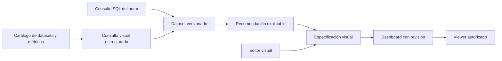
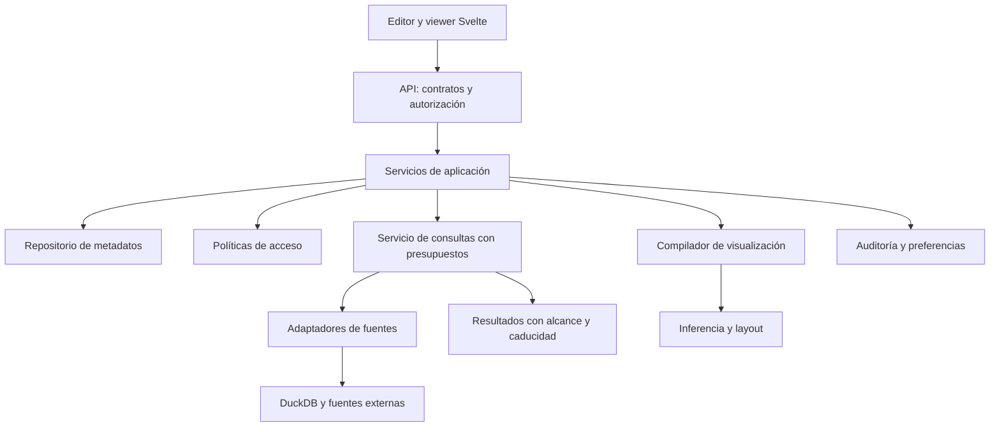

# Dirección de producto y arquitectura objetivo

**Fecha:** 2026-10-05; decisión de autoría aceptada: 2026-10-07.
**Estado:** dirección para la siguiente etapa;
los componentes objetivo aquí descritos no se consideran implementados.
Base factual: [auditoría](sqlviz-audit-2026-10-05.md).
Reglas de implementación y evaluación SOLID/integridad:
[revisión de buenas prácticas](sqlviz-engineering-practices-review.md).
Alcance detallado de lienzo, navegación y calidad de inferencia:
[Dashboard Studio](sqlviz-dashboard-studio-spec.md).
La [decisión de autoría visual](sqlviz-visual-authoring-decision.md) precisa los
tres niveles aceptados y sustituye la exclusión anterior del editor ECharts nativo.

## 1. Producto y público

**Propuesta:** SQLviz convierte datos y consultas en dashboards de alta calidad,
editables visualmente y confiables para compartir.

Hipótesis de público inicial: analistas, consultores y equipos pequeños que
necesitan entregar dashboards a personas que no escriben SQL. Priorizar
instalación local/self-hosted sencilla y un autor técnico que prepara datos.
Validar esta hipótesis con usuarios antes de invertir en SaaS multiempresa.

Tres trabajos diferentes:

| Persona | Trabajo | Interfaz principal |
| --- | --- | --- |
| Autor técnico | Conectar datos, preparar consultas y métricas | SQL, catálogo y vista previa |
| Diseñador/analista de negocio | Construir y ajustar dashboards | Canvas y configuración visual sobre datasets autorizados |
| Lector | Entender, filtrar y compartir resultados autorizados | Viewer sin editor SQL ni detalles internos |

La ventaja buscada es reducir el tiempo entre pregunta y dashboard publicable
sin perder control. SQL por sí solo y un constructor visual por sí solo no son
una diferenciación suficiente. La convivencia es viable: Metabase documenta
autoría mediante SQL y constructor gráfico. Esa evidencia respalda la modalidad
híbrida; no demuestra demanda o ventaja comercial de SQLviz.
[Referencia](https://www.metabase.com/docs/latest/questions/start).

## 2. SQL y UI sobre un mismo modelo

Mantener dos caminos de entrada con un resultado común:

Primera experiencia visual: elegir un dataset existente, asignar dimensión y
métrica, seleccionar o aceptar un gráfico y ajustar formato/layout. Esto se
puede entregar antes de implementar un modelador relacional completo.

La inferencia propone un punto de partida; el autor puede cambiarlo y volver al
automático. Ningún refresh, filtro o nueva recomendación debe borrar elecciones
explícitas. Los ajustes incompatibles con un nuevo esquema se señalan al usuario.

Autoría progresiva sobre la misma visualización: **Automático → Visual Builder →
ECharts native options**. El nivel experto edita opciones nativas JSON con preview,
validación y procedencia visible. SQLviz mantiene un contrato mínimo de identidad,
bindings y publicación; no replica toda la gramática de ECharts. Las propiedades
expertas prevalecen en su ámbito y persisten aunque no tengan control visual.
Restaurarlas es explícito y reversible. Estos niveles están planificados.

Una consulta visual es una estructura tipada que compila a SQL parametrizado.
No prometer conversión bidireccional de SQL arbitrario a controles: CTEs,
ventanas y dialectos no se representan necesariamente en un editor simple.
Al convertir a SQL avanzado, conservar el resultado y explicar si deja de ser
editable como consulta visual. La configuración del gráfico permanece editable.

Ejemplo de flujo objetivo: conectar ventas → guardar dataset → proponer KPI y
tendencia → ajustar moneda, paleta y secciones → publicar revisión → lector
filtra por fecha. El lector no necesita aprender SQL.

## 3. Qué significa premium

Premium es una combinación de presentación, precisión y comportamiento estable:

- Jerarquía tipográfica, espaciado, densidad y paletas coherentes; temas propios,
  formatos numéricos, unidades, zona horaria y localización.
- Canvas con alineación, resize, secciones, texto y plantillas; comportamiento
  responsive explícito para escritorio, tablet y móvil.
- Configuración visual persistida y versionada; vista previa fiel a lo publicado;
  undo/redo de edición y estados claros de guardado.
- KPI con comparación temporal correctamente definida, tooltips informativos,
  leyendas consistentes y estados de vacío, error y datos anteriores.
- Filtros previsibles, drill-down y cross-filter cuando el modelo los permita;
  datos tabulares y navegación por teclado como alternativas accesibles.
- Compartir con alcance y revocación reales; frescura visible y exportaciones
  reproducibles de una revisión.

Los cuatro gráficos iniciales a perfeccionar son KPI, líneas, barras y tabla.
Otros tipos se añaden por preguntas analíticas concretas, no por tamaño del catálogo.

## 4. Arquitectura: monolito modular con límites efectivos

Conservar Python, FastAPI, Svelte 5, ECharts, SQLGlot y DuckDB. Los seis paquetes
son un buen inicio; no introducir microservicios ni un nuevo framework de UI.
Separar responsabilidades dentro de los paquetes antes de aumentar su número.

`core` contiene contratos de dominio compartidos, independientes de HTTP y de
Svelte. `inference` transforma SQL/esquema/perfil/preferencias en recomendaciones.
`storage` implementa repositorios y migraciones. `api` ensambla servicios y expone
HTTP. `cli` configura el proceso y recursos. `web` presenta datos y emite comandos.

Servicios iniciales dentro de `sqlviz-api/services/`: `DashboardService`,
`QueryService`, `AuthorizationService` y `PublicationService` cuando exista
publicación. Evitar repositorios genéricos: usar operaciones del dominio que
realmente requieren transacción o sustitución de almacenamiento.

### Metadatos y datos analíticos

La consulta de un dashboard no debe tener acceso a credenciales, sesiones,
shares ni tablas internas. Separar conexiones y catálogos accesibles; un prefijo
`_sqlviz_` no es una frontera de seguridad.

Primero introducir repositorios y separar el contexto de ejecución sin romper
archivos existentes. Después evaluar SQLite para metadatos locales y PostgreSQL
para una edición de equipo. DuckDB sigue siendo motor analítico local; no se
reemplaza automáticamente por PostgreSQL para todas las consultas.

DuckDB permite escrituras concurrentes dentro de un proceso; no asumir que el
archivo admite varios procesos escritores. Empezar con un proceso dueño y
concurrencia limitada. Un cursor por operación debe cerrarse explícitamente.
[Referencia de concurrencia](https://www.duckdb.org/docs/current/connect/concurrency).

El formato `.sqlviz` actual es un contrato de compatibilidad. Cualquier nueva
persistencia exige versión de formato, copia previa, importación transaccional,
prueba de equivalencia y recuperación. No adjuntar la base de metadatos a las
conexiones accesibles desde SQL analítico.

### Compilador y runtime

Separar dos ciclos:

1. **Autoría:** analizar consulta y esquema → proponer visual → aplicar overrides
   validados → guardar revisión de especificación y layout.
2. **Lectura:** autorizar revisión → resolver filtros permitidos → ejecutar o
   recuperar datos → renderizar la especificación guardada.

Un viewer no debe recompilar y persistir recomendaciones en cada lectura. La
inferencia puede usar muestras limitadas para perfilar; nunca etiquetar agregados
incompletos como totales reales. Aprendizaje recibe correcciones explícitas con
ámbito de usuario/workspace y se persiste fuera del compilador.

## 5. Modelo de dominio mínimo

| Entidad | Responsabilidad e invariantes |
| --- | --- |
| Workspace | Límite de acceso, configuración y aprendizaje; empezar con uno local |
| DataSource | Conexión, dialecto, capacidades, identidad y referencia a credenciales |
| Dataset + revision | SQL o consulta visual, parámetros tipados, esquema, granularidad y fuente |
| Metric | Definición, agregación, unidad, dimensiones compatibles, propietario y versión |
| Visualization + revision | Dataset/bindings, recomendación, ajustes del builder, opciones ECharts expertas y formato efectivo |
| Panel | Instancia de visualización/revisión dentro del dashboard, con identidad estable, posición y tamaño |
| Dashboard + revision | Paneles con IDs estables, layout, tema y bindings de filtros |
| Publication | Referencia explícita a una revisión; borradores no alteran lo publicado |
| QueryExecution | Actor, recurso, parámetros, estado, tiempos, filas/bytes, truncamiento y frescura |
| Share / Grant | Alcance, permisos, expiración y revocación; nunca permiso general al proyecto por accidente |

No crear todas las tablas a la vez. Entregar invariantes en las fases del roadmap.
Contrato visual efectivo = propuesta aceptada + ajustes del builder + opciones
expertas validadas, con precedencia y conflictos definidos. Guardar su procedencia
por separado. Una publicación fija revisiones; editar una visualización compartida
no cambia silenciosamente dashboards publicados. Preferencias privadas del lector,
como su tema, no modifican
la revisión publicada del autor.

## 6. Ejecución y filtros

**Incremento implementado:** [QueryService con catálogo aislado y presupuestos](sqlviz-analytical-execution.md).
Cubre tablas locales y consultas HTTP; no entrega todavía todos los adaptadores,
parámetros tipados o cuotas de proceso descritos en esta arquitectura objetivo.

`QueryService` debe ser el único camino para ejecutar SQL de datasets:
autorización → validación de parámetros → política de consulta → adaptador →
presupuesto → resultado tipado. Incluir timeout, cancelación, límite de filas y
bytes, tamaño de cola y máximo de ejecuciones simultáneas. Un `LIMIT` no sustituye
un límite de CPU/memoria ni garantiza que una agregación cueste poco.

Para autores no confiables, aislamiento de proceso/SO y credenciales mínimas,
además del análisis del AST. Controlar acceso externo y carga de extensiones.
Quack no es requisito del producto local y no debe arrancar implícitamente.

Clave de caché: workspace, versión de dataset, parámetros normalizados, fuente,
contexto de autorización/políticas y vigencia de datos. Autorizar también los
aciertos de caché. TTL por sí solo no resuelve revocación ni RLS.

Los filtros interactivos no son controles de seguridad. El valor «Todos» puede
ampliar un filtro de negocio, pero jamás retirar una restricción de acceso. RLS
y permisos de columna se aplican antes de la consulta y del dominio de filtros,
incluyendo exportaciones, previews y caché.

En frontend, `execution_id` y revisión permiten descartar respuestas antiguas.
Cancelar una solicitud HTTP no implica cancelar el trabajo en la base: ambas
partes necesitan un contrato de cancelación.

## 7. Semántica, modelado y ETL

**Primero datasets reutilizables.** Nombre, descripción, campos, tipos, formatos,
parámetros y fuente. Esto habilita el editor visual y elimina copias de SQL.
Adelantar el contrato mínimo a la unidad de identidad/persistencia visual de E1,
antes del lienzo. Explorar SQL no exige crear un dataset compartido; promover la
consulta es una acción posterior. Catálogo completo y conectores permanecen en E3.
Polars y un grafo de transformaciones requieren un runtime propio con límites y
dependencias; incorporarlos cuando casos reales lo justifiquen, después del Studio.

**Después semántica explícita.** Dimensiones, métricas, tiempo, granularidad y
relaciones con cardinalidad. Definir medidas aditivas/no aditivas, razón de sumas
frente a promedio de razones, moneda y comparación de periodos. Evitar dobles
conteos al hacer joins. Sugerencias por nombres requieren confirmación del autor.
La compilación de métricas a SQL es una responsabilidad real de una capa
semántica; MetricFlow documenta esa separación.
[Referencia de dbt](https://docs.getdbt.com/docs/build/build-metrics-intro).

**Modelado ligero, progresivo.** Catálogo, relaciones verificadas y linaje
dataset → panel → publicación. Un modelador visual de relaciones puede venir
después de probar corrección de joins y agregaciones.

**ETL acotado.** Importar CSV/Parquet y conectar una fuente prioritaria con
credenciales mínimas; luego refresh, materializaciones SQL, historial y avisos
de frescura. Integrarse con transformaciones externas cuando se necesiten.
CDC, orquestador general y cientos de conectores quedan fuera del núcleo inicial.

IA opcional para explicar consultas, proponer títulos o asistir en SQL solo
después de estos límites. La IA no decide permisos ni certifica métricas.

## 8. Seguridad y operación

Primer límite: admin autenticado y viewer restringido por recurso. Posteriormente
introducir owner/admin/editor/viewer con permisos a fuentes, datasets,
dashboards, publicaciones y exportación. Construir RBAC antes de multiempresa;
RLS no se implementa ocultando controles del navegador.

Compartir requiere autorización en cada operación, expiración, revocación y
protección frente a intentos repetidos de contraseña. Sesiones por instancia y
workspace; cookies seguras bajo HTTPS, política CSRF/origen y proxy configurado
explícitamente. Logs con actor, recurso, resultado y trace_id, sin tokens,
contraseñas ni valores sensibles. Backups y restauración probada son parte de
la entrega, no una tarea posterior.

## 9. Decisiones y señales para revisarlas

| Decisión | Motivo | Revisar cuando |
| --- | --- | --- |
| SQL + edición visual | Aprovechar lo existente y ampliar autoría | Pruebas de usuarios muestren fricción concreta |
| Monolito modular | Menor coste operativo y migraciones graduales | Un límite medido de aislamiento/escalado exija separar un proceso |
| DuckDB analítico local | Portabilidad y base ya implementada | Carga/operación real requiera otro adaptador |
| Semántica declarativa pequeña | Métricas correctas y reutilización | Casos reales justifiquen ampliar tipos/relaciones |
| ETL ligero e integraciones | Mantener foco en dashboards | Usuarios paguen por necesidades repetidas de preparación |
| Investigación cognitiva opcional | Beneficio aún no validado | Un experimento supere una solución simple con usuarios reales |

La siguiente acción concreta es completar PATCH de dashboards y luego paneles
en E1 del [plan vigente](sqlviz-product-roadmap.md).
