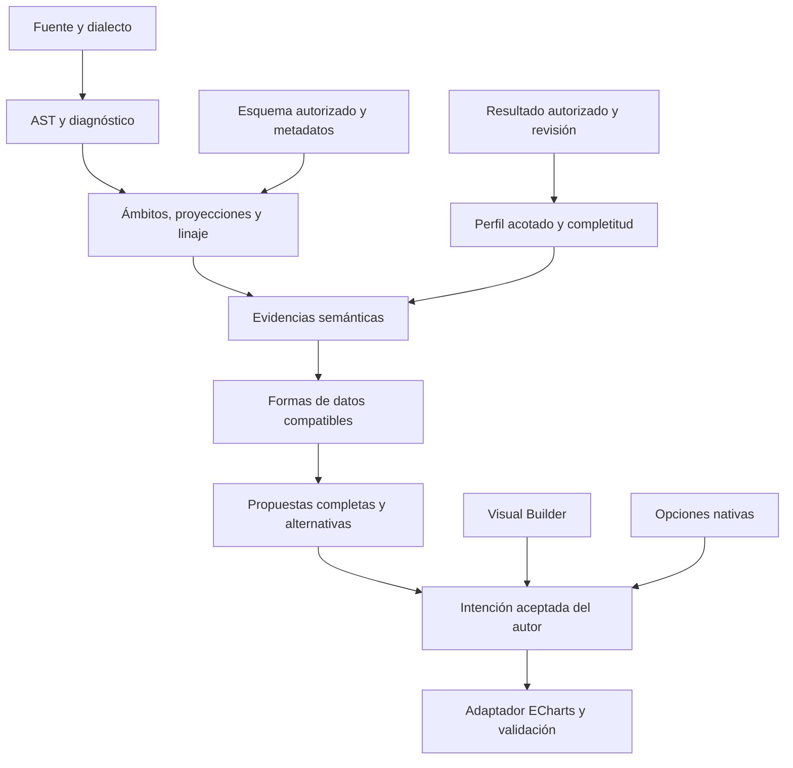

# AST e inferencia semántica: arquitectura objetivo

**Revisión:** 2026-10-08. **Estado:** diseño pendiente de implementación.
Amplía la [decisión de autoría](sqlviz-visual-authoring-decision.md) y el
[plan operativo](sqlviz-studio-delivery-plan.md). No cambia contratos publicados,
la política de ejecución ni el formato `.sqlviz`. El siguiente incremento de
código sigue siendo S1.1b: identidad y reconciliación.

## Qué usamos y dónde está el límite actual

La instalación revisada usa SQLGlot 30.11.0 y ECharts 6.1.0. SQLGlot genera el
AST en `parser/ast_helpers.py` de `sqlviz-inference`, con dialecto DuckDB.
También participa en la elegibilidad de consultas y parámetros de la API.
DuckDB analiza el script completo en S1.1a: conserva fuente y offsets, pero no
resuelve significado, identidad ni autorización.

El pipeline actual ya distingue señales SQL y perfiles de resultados, puntúa
candidatos y conserva trazas. Sin embargo, las búsquedas globales `find/find_all`
no separan suficientemente los ámbitos de CTE, subconsultas y salida final.
`parse_sql` pierde el diagnóstico al devolver `None` ante cualquier excepción.
El builder de `VisualSpec` todavía usa primera/última columna en muchos casos,
y el renderer cartesiano utiliza solo la primera medida. No existe aún el
análisis semántico profundo descrito aquí.

La cobertura profesional significa declarar dialecto, versión y capacidades,
diagnosticar límites y preservar exactitud. **No significa prometer que cualquier
SQL de cualquier motor tendrá un AST semánticamente completo.** SQLGlot es un
parser/transpilador deliberadamente tolerante, no el validador de ejecución del
motor. Sus utilidades de tipos y calificación necesitan contexto de esquema.
Ver [documentación SQLGlot](https://sqlglot.com/sqlglot.html),
[calificación](https://github.com/tobymao/sqlglot/blob/main/sqlglot/optimizer/qualify.py)
y [linaje](https://sqlglot.com/sqlglot/lineage.html).

DuckDB es el dialecto y motor inicial soportado. Un futuro conector declara su
dialecto y corpus de compatibilidad; transpilar no garantiza equivalencia.
Extensiones o UDF desconocidas conservan su expresión y significado desconocido.
La incapacidad de analizar una consulta nunca habilita una vía que eluda la
política de ejecución. Sintaxis válida, consulta autorizada y conocimiento de
negocio son comprobaciones diferentes.

Un AST opaco o un nodo de fallback del parser no cuenta como análisis completo.
La cobertura se evalúa por construcción y por hecho extraído: se pueden conocer
proyecciones sin conocer la unidad de una UDF. Exponer ese límite con diagnóstico,
sin inventar semántica ni confundir recuperación del parser con soporte probado.

## Pipeline objetivo y contratos internos



Los nombres siguientes describen responsabilidades internas previstas; no son
una nueva gramática pública ni clases ya entregadas.

| Resultado | Responsabilidad y garantías |
| --- | --- |
| Análisis sintáctico | Fuente intacta, dialecto/versión, AST interno, diagnóstico estructurado y cobertura. Diferenciar error de sintaxis, construcción no soportada y fallo interno; no colapsarlos en `UNKNOWN` |
| Análisis de salida | Ámbito por SELECT/CTE/subconsulta/rama de UNION; proyecciones, alias, expresiones, esquema y linaje de salida, con referencias ambiguas explícitas |
| Evidencia semántica | Tipo real, dimensión/medida posible, agregación, ventana, granularidad, orden, filtros y unidades declaradas. Cada hecho distingue probado, sugerido o desconocido y su origen |
| Perfil de resultados | Nulos, cardinalidad, distribución y relaciones observadas, junto con filas/bytes, muestreo, truncamiento y revisión. No generalizar una muestra como certeza sobre toda la fuente |
| Compatibilidad de forma | Validar roles, dominios, claves y estructura antes de puntuar familias. Informar campos/metadatos faltantes y adaptaciones necesarias |
| Propuesta visual | Familia, bindings por identidad, series/componentes, formato, tratamiento explícito de datos, alternativas y razones. No solo `chart_type` |
| Intención confirmada | Propuesta aceptada, ajustes del builder y ajustes expertos versionados. La nueva recomendación no reemplaza decisiones manuales |
| Renderizado efectivo | Datos autorizados actuales + intención + capacidades de la versión del motor. Validar referencias y producir opciones sin persistir copias de resultados |

SQLGlot queda detrás del adaptador de análisis. Los contratos de dominio no
exponen sus clases como formato persistido ni como API pública; las actualizaciones
de la biblioteca pasan por corpus de regresión. Conservar original y una copia
para calificación; no ejecutar SQL reescrito para facilitar la inferencia.

## Reglas que evitan gráficos convincentes pero incorrectos

Analizar la salida final y su linaje. Una agregación dentro de una CTE no implica
que todas las columnas finales sean agregadas; una ventana no reduce filas como
`GROUP BY`. `SELECT *`, posiciones en GROUP/ORDER, alias duplicados, conjuntos,
CTE recursivas y columnas sin esquema requieren resolución o diagnóstico.
La granularidad inferida conserva su evidencia; sin claves y catálogo no se
puede demostrar unicidad ni detectar todo fan-out de joins.

Un entero puede ser ID, código o medida. Un nombre `revenue` no demuestra moneda;
`month` como string no demuestra una fecha ordenable. Ratios, promedios,
percentiles y acumulados no se vuelven aditivos por aparecer en una columna
numérica. Mantener DECIMAL, fechas, zona horaria y nulos hasta una conversión de
renderizado comprobada; `Number(null)` no debe crear un cero ficticio.

Toda agregación, binning, ordenación o cálculo derivado tiene parámetros,
procedencia y preview. No sumar duplicados, inventar nodos, completar fechas,
normalizar porcentajes, eliminar extremos ni limitar categorías silenciosamente.
Una estructura válida no demuestra intención: los mismos datos pueden permitir
barras, pie o una tabla. Proponer alternativas o preguntar «¿comparar categorías
o mostrar participación?» cuando esa decisión cambie la lectura.

La elegibilidad es una comprobación separada de la puntuación. No recomendar
Sankey solo porque las columnas se llamen `source/target`; verificar valores,
referencias, pesos y ciclos. No recomendar jerarquías sin validar IDs/padres.
Los porcentajes de confianza requieren calibración; mientras no exista,
mostrar evidencia y ambigüedad, sin vestir una puntuación como probabilidad.

El fingerprint actual agrupa patrones analíticos y colisiona por diseño. No
sirve como ID de panel/dataset, prueba de equivalencia SQL, clave única de caché
ni garantía de reconciliación. La identidad de autoría es independiente.

## Datos para cualquier familia, sin imponer otro lenguaje

SQL sigue preparando datos. Una visualización puede tener uno o varios inputs
nombrados, cada uno ligado a dataset/revisión mediante IDs, nunca por orden de
consultas. El builder asigna roles y un adaptador de forma validado construye
la estructura específica. Eso no convierte el adaptador en un ETL general.
La [matriz de capacidades](sqlviz-visual-capability-matrix.md) define las familias.

| Caso | Salida SQL y contexto | Trabajo del adaptador |
| --- | --- | --- |
| Sankey | `source, target, value` | Nodos y enlaces; claves, duplicados, pesos y ciclos; ninguna suma implícita |
| Red enriquecida | Input `nodes`: `id, label, category`; input `edges`: `source_id, target_id, weight` | Join por ID validado, nodos aislados conservados, extremos inexistentes diagnosticados |
| Jerarquía | `id, parent_id, label, value`, o caminos de niveles declarados | Árbol anidado; raíces, huérfanos, ciclos y semántica de totales; no duplicar valor padre/hijo |
| Candlestick y volumen | `date, open, close, low, high, volume` | Orden OHLC explícito, validación de rangos y alineación de series; no depender del orden del SELECT |
| Mapa | `region_code, value` + recurso GeoJSON/SVG registrado | Correspondencia territorial, CRS cuando proceda, nombres no encontrados y revisión del recurso |
| Gantt | `task_id, start_time, end_time, group` | Intervalos validados y renderer `custom` registrado; conservar zonas horarias y duraciones |
| Superficie | Malla ordenada `x, y, z`; paramétrica puede requerir `u, v` | Verificar topología y límites; depender de GL compatible, no ejecutar ecuaciones pegadas como JS |

Ejemplo de datos para flujos:

```sql
SELECT origin AS source, destination AS target, SUM(amount) AS value
FROM transfers
GROUP BY origin, destination;
```

La consulta declara la agregación. El autor elige la lectura y asigna los roles;
SQLviz prepara nodos/enlaces y muestra cualquier incompatibilidad. ECharts no
usa `dataset/encode` universalmente: estructuras especiales necesitan datos en
las series. Ver [dataset](https://echarts.apache.org/handbook/en/concepts/dataset/).
Por ello, el runtime debe soportar tanto codificación tabular como adaptación
estructurada. Mapas, iconos y renderizadores son recursos de presentación,
no un motivo para exigir Python o un nuevo lenguaje de consultas al usuario.

## Experiencia propuesta: mostrar posibilidades y lo que falta

Al ejecutar, ofrecer una propuesta completa y un catálogo contextual: «Disponible»,
«Requiere asignar campos» o «Requiere recurso/extensión». Una red con dos inputs
puede indicar «Selecciona el dataset de nodos»; un mapa, «Selecciona cartografía».
No llenar la pantalla con todos los controles. La explicación abre detalles de
fuente → campo → rol → transformación → gráfico, bajo demanda.

Esa experiencia es una hipótesis de producto por validar con tareas reales, no
una afirmación de originalidad mundial. La ventaja buscada es ofrecer libertad
sin que el autor tenga que adivinar formatos o perder sus decisiones.

## Límites entre módulos y operación

- **Core:** identidad, contratos versionados de evidencias/bindings y compatibilidad;
  sin SQLGlot, DOM, consultas o resultados globales.
- **Inference:** adaptador SQLGlot, resolución, perfiles y propuestas reproducibles.
  Depende de esquema/resultados suministrados, no consulta almacenamiento por su cuenta.
- **Aplicación/API:** permisos, ejecución, presupuestos, revisiones y confirmación.
  Un diagnóstico de inferencia no sustituye el control de consultas.
- **Storage:** intención, referencias, revisiones y recursos; cambios atómicos y
  migraciones. No persistir ASTs de biblioteca ni resultados como configuración.
- **Web/renderer:** borradores, preview, medición y adaptación ECharts; no decidir
  qué tablas puede consultar un lector. Builder y experto comparten este runtime.

Acotar bytes/tokens, sentencias, profundidad/nodos AST, tiempo y concurrencia;
los límites actuales de S1.1a no cubren por sí solos todos esos presupuestos.
Si la medición demuestra que el análisis profundo necesita ejecución aislada,
separarlo con un límite cancelable; no usar un timeout que deje trabajo ilimitado.
El perfilado no consulta más datos sin autorización ni vuelve a ejecutar SQL
para medir cada interacción. Límites, caché y trazas se diseñan por aplicación.

Para inputs múltiples, confirmar un conjunto coherente por generación, revisión
de parámetros/filtros y fuente. No publicar nodos nuevos con enlaces de la
ejecución anterior. Cuando el motor permita una lectura consistente, usarla;
entre fuentes sin snapshot común, registrar su frescura y explicar ese límite.
Un fallo conserva el conjunto confirmado. Layout y navegación no vuelven a
ejecutar consultas ni reemplazan la geometría manual mediante inferencia.

La caché incluye dialecto, versión del analizador, fuente, esquema, revisión de
resultado y contexto de acceso relevante; jamás compartir resultados entre
usuarios por fingerprint. Las trazas registran etapas, duración, evidencia y
diagnóstico sin volcar filas, literales sensibles o credenciales por defecto.
Aprendizaje posterior opt-in no decide permisos, modifica SQL ni bloquea guardado.

## Entrega pequeña y evidencia de calidad

S1.1b/c permanece primero: sin identidad y confirmación atómica no se puede
conservar con confianza una visualización compleja. En S3 preparar referencias
a múltiples inputs; S4 entrega un flujo acotado completo; S5 amplía el analizador
y las familias por paquetes, según el plan operativo.

La aceptación de cada paquete exige corpus independiente de consultas y datos:
CTE anidadas, UNION, ventanas, joins y alias; SELECT permutado; funciones conocidas
y opacas; NULL/DECIMAL/fechas; ratios no aditivos; datos vacíos, truncados y
ambiguos; jerarquías rotas, enlaces faltantes, mapas sin correspondencia y series
con IDs reordenados. Los ejemplos se anotan por hechos y alternativas admisibles,
sin fingir que existe un único gráfico correcto para toda consulta.

Medir exactitud de hechos y bindings, propuestas inválidas, abstención, pérdida
de datos, latencia y memoria por tamaño; registrar también cambios tras actualizar
SQLGlot/ECharts. La cobertura de syntax/AST, familias representables y calidad de
recomendación son métricas separadas. Una familia solo se entrega cuando pasa
preview → guardar → filtrar → reabrir → viewer con la misma revisión y recursos.
