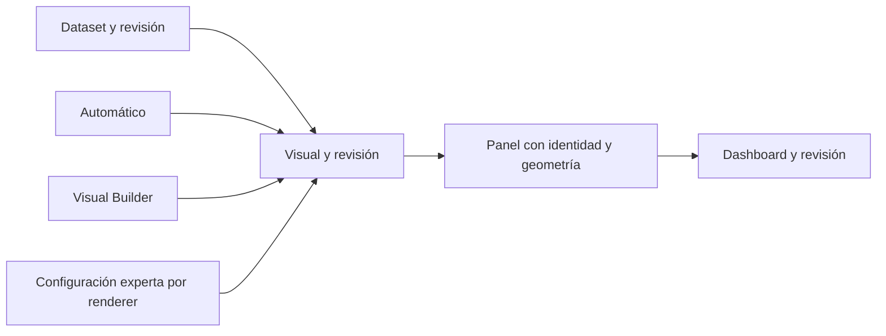

# Dashboard Studio: plan operativo

**Actualizado:** 2026-10-08. **Prioridad acordada:** composición libre sobre doce
columnas y tres niveles de autoría sobre una misma visualización. Este documento
reemplaza el orden inmediato anterior del [roadmap](sqlviz-product-roadmap.md).
E0–E5 conservan su función de mapa técnico e historial; S0–S8 definen el trabajo
actual. No son compromisos de calendario.

## Dirección del producto

SQLviz debe permitir pasar de una consulta a un dashboard legible, personalizable
y compartible. El autor técnico prepara datos con SQL; el autor visual compone
gráficos; el lector navega y filtra sin escribir código. No exigir un modelo
semántico completo para obtener el primer gráfico.

Del informe aportado adoptamos la separación entre datos y presentación, la
promoción de exploraciones a objetos reutilizables, la autoría progresiva y el
linaje bajo demanda. Conservamos SQL nativo y DuckDB. Polars, DAG de
transformaciones, métricas gobernadas e IA son extensiones posteriores; no
prerrequisitos del Studio. Arrow puede servir para intercambio cuando exista
una necesidad medida, sin convertirse obligatoriamente en almacenamiento.

No construiremos un notebook ni un orquestador como experiencia principal.
Tampoco presentaremos una etiqueta comercial o una supuesta originalidad mundial
como resultado de ingeniería: la diferencia debe observarse al crear y leer
dashboards reales.

## Qué existe y qué falta

Ya existen ejecución SQL, recomendaciones básicas, gráficos, ajustes parciales,
navegación compacta y filtros. Los incrementos recientes han reforzado permisos,
aislamiento, integridad, PATCH, guardado confirmado y recuperación ante fallos.
Esa base era necesaria, pero no equivale a un Studio visual completo.

**Entregado en S0:** núcleo interno de geometría manual, con validación,
movimiento, tamaño y evaluación de espacio. **Todavía no existe drag/resize en
la UI, persistencia de este lienzo ni sus endpoints.** Tampoco están entregados
el Visual Builder completo, datasets reutilizables o el editor experto.
Ver el [contrato y sus límites](sqlviz-canvas-contract.md).

**S1.1a implementado:** [parsing de scripts SQL](sqlviz-sql-script-parsing.md),
integrado en Run, contador y foco. La identidad/reconciliación y el guardado del
layout siguen pendientes; no se declara S1 completa.

**Matriz analítica incorporada al alcance central:** la tabla actual es plana.
El [módulo de matriz](sqlviz-analytical-matrix-spec.md) tiene entregas M1–M9,
renderer de grilla, medidas/totales por contexto y drag de campos. El primer
recorrido entra en S3/S4; no se pospone hasta cubrir todas las familias ECharts.
Su diseño y el desglose de S2 siguientes todavía no habilitan nuevas interacciones.

## Libertad con límites que se pueden explicar

| Decisión | Regla de producto |
| --- | --- |
| Ancho | Doce columnas; posición y extensión editables. Un panel nunca sale del grid |
| Alto | Altura exacta ajustable. El nuevo lienzo no hereda el techo legacy de 900 px |
| Mínimo | Separar mínimo estructural y mínimo de contenido. Los 120 px actuales son compatibilidad estructural, no garantía de legibilidad |
| Legibilidad | Medir título, ejes, leyenda, controles y área útil según el visual. Ofrecer perfiles compacto/normal cuando proceda; no imponer un mismo mínimo a KPI, sparkline, tabla y multiserie |
| Colisiones | El candidato inválido se muestra y no se confirma. Ningún vecino se desplaza sin preview y aceptación |
| Orden | Mover un panel no reordena SQL, no cambia su identidad ni transfiere ajustes a otra consulta |
| Alineación | Grid y guías durante edición; ajustes exactos mediante controles. El magnetismo será una ayuda reversible |
| Calidad visual | Advertir y proponer alternativas ante saturación, leyendas grandes o etiquetas truncadas; explicar el motivo |
| Datos | Nunca ocultar truncamiento, convertir NULL a cero o cambiar agregaciones para mejorar la apariencia |

Bloquear geometría inválida, referencias rotas y configuraciones no soportadas.
Los consejos de estilo no deben convertirse en prohibiciones arbitrarias. Un
layout válido puede seguir contando mal una historia: formato, unidades,
agregación y significado requieren comprobaciones separadas.

La recomendación inicial de un alto cómodo para gráficos cartesianos es una
hipótesis que se validará con contenido real, no una constante universal. S0
recibe mínimos medidos del renderer; todavía no los mide ni evalúa tipografía.

## Tres niveles, una visualización

| Nivel | Trabajo del usuario | Criterio de entrega |
| --- | --- | --- |
| Básico: inferencia automática | Ejecutar y aceptar una propuesta o elegir una alternativa | Elegir campos y series, explicar ambigüedad y conservar datos; no limitarse a recomendar el tipo de gráfico |
| Intermedio: Visual Builder | Ajustar X/Y, series, color, tooltip, formatos y presentación | Cambios persistidos y reversibles; campos ligados por identidad, sin depender del orden de SELECT |
| Experto: ECharts native options | Inspeccionar y editar JSON nativo con preview | Validar estructura y referencias; precedencia visible; mismo resultado al filtrar, recargar y compartir |

Los controles del builder se agrupan en Datos, Visual, Formato e Interacción.
Las opciones nativas aparecen bajo demanda en el mismo espacio de edición.
Cambiar de nivel no duplica el gráfico ni descarta decisiones anteriores.

La matriz sigue los mismos niveles: automático propone ejes/medidas, builder
organiza Filas/Columnas/Valores, experto edita configuración tipada de grilla y
medidas SQL. ECharts native options aplica a gráficos ECharts. Las revisiones,
bindings, precedencia y publicación son comunes; cada renderer tiene su contrato.

El modelo separa intención del autor y opciones efectivas del renderer. ECharts
permite separar datos y codificación mediante
[dataset y encode](https://echarts.apache.org/handbook/en/concepts/dataset/).
SQLviz conserva referencias, permisos, revisiones y procedencia; no introduce una
nueva gramática pública que replique ECharts. La
[decisión de autoría](sqlviz-visual-authoring-decision.md) establece los límites.

El objetivo ampliado incluye las 23 familias del núcleo ECharts y combinaciones,
con inputs nombrados y adaptación de formas de datos. GL y plugins tienen
dependencias y verificación propias. La [matriz de capacidades](sqlviz-visual-capability-matrix.md)
separa representabilidad, builder e inferencia; la
[arquitectura semántica](sqlviz-semantic-inference-architecture.md) describe AST,
ámbitos, linaje, evidencia y abstención. Son diseños pendientes: no amplían los
ocho identificadores legacy entregados ni cambian el siguiente paso S1.1b.

## Orden de construcción

Cada etapa se divide en incrementos pequeños. Una capacidad con UI no se cierra
solo por tener controles: debe guardar, reabrir y funcionar en el viewer. Se
cruzan las capas necesarias manteniendo sus responsabilidades separadas.

| Etapa | Entrega | Evidencia necesaria para pasar a la siguiente |
| --- | --- | --- |
| **S0 — Entregado** | Núcleo de geometría manual | Doce columnas, posiciones y alturas exactas, colisiones, operaciones inmutables y diagnóstico de espacio; pruebas sin HTTP, SQL ni DOM |
| **S1 — En curso** | Lienzo persistido, primero con controles de posición/tamaño | S1.1a parsing entregado; identidad/reconciliación, contrato HTTP de layout y revisión, escritura atómica, migración ensayada sobre copias, draft/reintento; mismo diseño tras reabrir y compartir |
| **S2** | Drag/resize y edición reversible | Guías, preview, cancelación, undo/redo y bloqueo; teclado y alternativa por clic/tap; mover no ejecuta SQL ni roba gestos del gráfico |
| **S3** | Dataset mínimo, visual y panel separados; M1 de matriz | Una definición alimenta dos visuales; esquema/bindings, grano y medidas mínimas con revisiones; SQL reordenado no transfiere personalizaciones |
| **S4** | Primer recorrido de los tres niveles y matriz M2–M5 | Gráficos y matriz con builder/configuración experta → guardar → filtrar → reabrir → viewer → reset/undo; totales y asociaciones comprobados |
| **S5** | Inferencia y renderizado ampliados; matriz M6–M7 | Corpus independiente, familias/grilla, fechas/unidades/nulos, formato y escala; calidad medida con casos que no replican la implementación |
| **S6** | Pantalla/scroll y áreas del dashboard | Aprovechar altura disponible sin recortar; mínimos medidos, fallback explicado, secciones y lectura responsive; diseño desktop preservado |
| **S7** | Interacciones y experiencia del lector | Filtros versionados y con alcance, crossfilter visible, drill autorizado, reset y navegación contextual; no perder significado al cambiar de dashboard |
| **S8** | Publicación y acabado | Revisión publicada estable, preview fiel, accesibilidad, rendimiento, estados y exportaciones autorizadas; tareas observadas con usuarios |

### S1: primera experiencia visible

S1 es una etapa amplia. Se ejecuta por las siguientes partes pequeñas, cada una
con un commit revisable y validación adecuada. Una parte técnica no cierra por
sí sola la experiencia completa.

| Parte | Estado | Alcance y cierre |
| --- | --- | --- |
| **S1.1a** | Implementado | Parsing nativo del script completo, source/offsets, contador y foco; sin escrituras ante sintaxis inválida |
| **S1.1b** | Siguiente | Identidad y reconciliación: reordenar/insertar/editar conserva asociación correcta; ambigüedad explícita, sin emparejar solo por índice |
| **S1.1c** | Pendiente | Integración transaccional de cambios y borrados; un fallo no confirma parte del conjunto |
| **S1.2a** | Pendiente | Contrato persistido de layout y modo pantalla/scroll por dashboard; fuente única de geometría |
| **S1.2b** | Pendiente | Migración, repositorio y revisión; ensayo sobre copias y rechazo de conflictos |
| **S1.2c** | Pendiente | API tipada de layout, validación completa y permisos |
| **S1.2d** | Pendiente | Controles de posición, ancho y alto; draft, confirmación y reintento |
| **S1.2e** | Pendiente | Recorrido guardar → reabrir → compartir, mismo layout y configuración |

Antes de iniciar S2 y las etapas posteriores, dividirlas con la misma disciplina.
No se implementa una etapa amplia en un único cambio.

1. Revisar cómo se asigna hoy la identidad de paneles al editar y ejecutar SQL.
   Establecer reconciliación segura antes de asociar geometría persistida. Un
   índice de consulta o un `split(';')` no son identidad estable.
2. Diseñar un documento de layout versionado con referencias a esos IDs y una
   única fuente de posición/tamaño. No mantener dos alturas canónicas entre
   overrides legacy y el nuevo canvas; definir su adaptación y migración.
3. Añadir repositorio transaccional y control de revisión para rechazar guardados
   obsoletos. Probar borrado, conflicto y fallo parcial; viewer solo lee.
4. Integrar controles de posición, columnas y alto, con borrador, confirmación y
   reintento. Cambiar geometría usa el resultado disponible y redimensiona el
   renderer; no vuelve a ejecutar la consulta.
5. Verificar guardar → recargar → abrir enlace compartido. Después integrar los
   gestos de S2 sobre el mismo contrato, sin una segunda vía de persistencia.

La revisión pendiente de dimensiones de E1 se incorpora aquí. Migraciones y
correcciones de dependencias requeridas por este flujo son parte de su alcance;
no se abre una refactorización ilimitada de toda la plataforma antes de la UI.
Los cambios no alterarán proyectos reales durante los ensayos.

### S2: mover con confianza

La zona para arrastrar pertenece a la cabecera del panel y los tiradores aparecen
al seleccionar. El área del gráfico conserva tooltip, zoom y selección. El grid
se muestra durante edición; no añade ruido al viewer.

Cada gesto crea una sola entrada de undo. Escape restaura el estado inicial y un
fallo de guardado conserva la revisión confirmada y el borrador recuperable. No
guardar en cada evento de movimiento. Si se añade compactación o empuje de otros
paneles, debe ser una acción explícita con preview.

Además de teclado, ofrecer controles por clic/tap para mover y ajustar sin
arrastrar. El teclado por sí solo no cubre la alternativa de puntero requerida
por [WCAG 2.2, movimientos de arrastre](https://www.w3.org/WAI/WCAG22/Understanding/dragging-movements.html).
Probar touch, zoom, foco y cancelación, sin declarar conformidad solo por añadir
botones.

| Parte | Cierre previsto |
| --- | --- |
| S2.1 | Operación de gesto sobre geometría S1: ID estable, inicio/preview/confirmación/cancelación, una entrada de undo |
| S2.2 | Drag desde cabecera con captura de puntero, destino/guías y preview de colisión; ningún vecino cambia sin acción explícita |
| S2.3 | Resize de ancho/alto, mínimos de contenido y límites de viewport; tiradores siempre recuperables |
| S2.4 | Alternativas por clic/tap y teclado; touch, autoscroll controlado, zoom y foco; el contenido conserva sus gestos |
| S2.5 | Undo/redo, bloqueo y guardado por revisión; conflicto/fallo conserva confirmado y draft recuperable |
| S2.6 | Guardar → recargar → viewer; mismo diseño, sin ejecutar SQL al mover; navegación y modo pantalla/scroll conservados |

Arrastrar campos del builder, ajustar columnas de matriz y mover paneles del
dashboard son operaciones distintas. La [especificación de matriz](sqlviz-analytical-matrix-spec.md)
define sus zonas y persistencia. El docking de herramientas del editor es una
evolución posterior al primer recorrido S4; usa preferencias privadas y no
reordena consultas ni paneles publicados. No introducir ventanas flotantes como
requisito para diseñar una matriz.

### S3–S5: el núcleo visual recibe la mayor inversión

Separar definición de dataset de resultado de ejecución, y visual reutilizable
de panel colocado. Las revisiones publicadas fijan referencias; actualizar una
visualización compartida no cambia dashboards publicados silenciosamente.

S4 empieza con un caso acotado pero completo: fecha, categoría, ingresos y coste;
inferencia de campos/series; builder para X/Y/series; ajuste nativo de una línea
de referencia y leyenda. Las opciones expertas no quedan relegadas al final.
Primero soportar correctamente línea, barras, KPI y tabla; incorporar el flujo
de matriz M2–M5 dentro de S4 antes de ampliar el catálogo general en S5. La matriz
requiere medidas con contexto y una grilla propia, además del renderer ECharts.

No basta con JSON sintácticamente válido: validar capacidades, referencias y
conflictos. Definir edición de listas mediante IDs estables; no aplicar un merge
genérico por índice. Preservar opciones que el builder no representa y explicar
su precedencia. El JSON inicial no ejecuta callbacks JavaScript ni HTML arbitrario.

El corpus debe incluir columnas permutadas, múltiples medidas, fechas reales,
NULL, alta cardinalidad, unidades diferentes y resultados ambiguos. No producir
porcentajes de confianza sin calibración. Una tabla o una pregunta concreta al
autor pueden ser mejores que una elección arbitraria. S4 ya debe cumplir
corrección básica; S5 amplía calidad y cobertura, no pospone esos mínimos.

### Partes pequeñas de S3–S5

Este desglose fija dependencias y cierres; no permite saltar S1/S2. Cada parte
se concreta antes de implementarla, con un cambio revisable. S4 y S5 son recorridos
con integración y evidencias; no se cierran solo entregando modelos.

| Parte | Alcance y cierre previsto |
| --- | --- |
| S3.1 | Dataset/revisión y esquema de salida separado del resultado; grano/medidas mínimas para M1, permisos y parámetros conservados |
| S3.2 | Campos/bindings con identidad y diagnósticos de incompatibilidad; una consulta reordenada no transfiere roles |
| S3.3 | Visual/revisión separada del panel; referencias a uno o varios inputs nombrados, sin asociación por índice |
| S3.4 | Persistencia, migración y publicación de referencias; un dataset alimenta dos visuales y una visual admite inputs autorizados múltiples |
| S3.5 | Selector de consulta/dataset, resultados con esquema/preview acotado y promoción/reutilización desde editor multiconsulta; sin duplicar SQL ni crear vistas físicas |
| S3.6 | F1 del Mapa del dashboard: proyección autorizada de referencias reales, IDs/revisiones y diagnósticos; sin segundo repositorio de dependencias |
| S4.1 | Propuesta completa para el corpus inicial cartesiano; tipos/nulos, múltiples medidas y alternativas coherentes; no depender de primera/última columna |
| S4.2 | Builder contextual al dataset: elegir campos/roles/series y presentación; preview/draft, cambio de esquema/dataset con diagnóstico y cambios reversibles |
| S4.3 | Compilación al runtime ECharts y registro mínimo de capacidades; tabla/KPI conservan su adaptador de producto |
| S4.4 | Editor JSON nativo, referencias, IDs y precedencia; sin callbacks arbitrarios, sin restringirlo a ajustes cosméticos |
| S4.5 | Persistir → filtrar → reabrir → viewer → reset/undo, sobre la misma visualización; errores atómicos y opciones fuera del builder preservadas |
| S4.6a | F2: Mapa bajo demanda, contexto y navegación al objeto; diagrama y alternativa en lista sin ocupar espacio permanente |
| S4.6b | F3: Mapa actualizado al crear/reutilizar/editar/borrar; draft/confirmado, fallos y respuestas tardías coherentes |
| S3.M1 | Contrato de matriz: ejes, medidas, grano, claves/celdas y corpus; desglose M1.1–M1.3 en su especificación |
| S4.M2–M5 | Motor de medidas/contextos, API/persistencia, grilla y builder con drag de campos; primer flujo guardado/reapertura/viewer de matriz |
| S5.M6–M7 | Formato/semántica avanzada, virtualización/carga progresiva y pruebas de escala de matriz; independiente de la ampliación ECharts |
| S5.1a | Adaptador AST versionado y diagnóstico estructurado; dialecto/cobertura explícitos y regresión con SQLGlot |
| S5.1b | Ámbitos y proyecciones: CTE/subconsultas/UNION/ventanas; no confundir agregación interna con salida final |
| S5.1c | Esquema, alias, linaje/tipos y granularidad con evidencia; ambigüedad explícita, sin usar fingerprint como identidad |
| S5.2 | Perfil acotado, distribución, relaciones y completitud; precisión, unidades y agregaciones no aditivas |
| S5.3 | Adaptadores de forma y elegibilidad por familia; inputs múltiples, jerarquías/enlaces inválidos y recursos ausentes diagnosticados |
| S5.4 | Propuestas completas, alternativas, explicaciones y abstención; catálogo contextual según datos y recursos; calibración antes de probabilidades |
| S5.5a | Cartesianos y composiciones: multiserie, área, polar, mixtos, calendar/matrix y variantes |
| S5.5b | Distribución y finanzas: boxplot, candlestick, histogramas y cálculos explícitos |
| S5.5c | Jerarquías y redes: tree/treemap/sunburst/graph/sankey/chord, con validación de relaciones |
| S5.5d | Geografía y rutas: map/geo/lines, recursos versionados y correspondencias territoriales |
| S5.5e | Indicadores/multidimensional: gauge/funnel/radar/parallel/pictorialBar/themeRiver/effectScatter; controles y límites específicos |
| S5.5f | `custom` registrado y templates: contratos de roles/opciones y código confiable instalado, sin evaluar JSON como JavaScript |
| S5.6a | Spike GL/plugins: compatibilidad de versiones/build, recursos y presupuestos; dictamen con evidencia antes de adoptar dependencias |
| S5.6b | Familias GL/extensiones verificadas, por incrementos; editor/viewer, liberación de recursos y fallback explícito |

Los paquetes S5.5 y S5.6 se dividen por familia y componente al iniciarse. Para
cada uno, el cierre distingue automático, builder y experto según la matriz;
configurable no significa automáticamente inferible. No posponer en S4 tipos,
precisión, nulos o rechazo de referencias inválidas a la expansión de S5.

M8 de matriz se integra en S7 para interacción avanzada y M9 en S8 para publicación/
exportación y tareas de referencia. M1–M9 son partes del plan vigente, no una
segunda secuencia que posponga permisos, filtros básicos o cálculo correcto.

El [recorrido del editor multiconsulta](sqlviz-visual-authoring-decision.md#del-editor-multiconsulta-a-campos-reutilizables)
precisa cómo los bloques separados por `;` alimentan datasets y varios visuales.
Guardar definición, ejecutar/preview y materializar/importar filas son acciones
distintas; S3 no crea vistas físicas ni convierte el script entero en un dataset.

El [Mapa vivo del dashboard](sqlviz-dashboard-map-spec.md) refleja ese flujo
durante la construcción. F1–F3 muestran relaciones declaradas en S3/S4; el linaje
de campos F4 acompaña S5 y publicación/acceso F5 acompaña S8. No bloquea el primer
gráfico a la espera de entender toda consulta SQL y no incorpora un editor ETL.

### S6: altura y áreas sin trucos visuales

`scroll` admite crecimiento vertical. `screen` utiliza el alto realmente disponible
tras cabecera y filtros; distribuir filas exige respetar mínimos de contenido.
S0 solo evalúa viabilidad: todavía no distribuye ni llena el viewport.

Si no cabe, explicar qué panel necesita espacio y ofrecer reorganizar, paginar
o usar scroll. No esconder overflow ni reducir tipografía para simular pantalla
sin scroll. El fallback responsive no debe sobrescribir la intención guardada.
Validar inicialmente 1366×768, 1440×900 y 1920×1080, además de móvil y zoom.

Las áreas serán secciones con nombre, orden, título y agrupación, inicialmente
de un solo nivel: resumen, tendencias y detalle, por ejemplo. Permitir selección
y ajuste de grupo antes de introducir contenedores recursivos. Las áreas del
dashboard y `grid` de ECharts —sus coordenadas cartesianas internas— son conceptos
distintos. El autor no tendrá que escribir CSS grid para componer una página.

## Arquitectura y disciplina de entrega

- **Core:** invariantes y operaciones puras; sin HTTP, DB, DOM ni SQL ejecutado.
- **Aplicación:** casos de uso, permisos, revisión y coordinación de guardado.
- **Storage:** escrituras atómicas y migraciones explícitas; aprendizaje opcional
  fuera de la confirmación principal.
- **API:** contratos tipados y errores predecibles; no confiar en validación UI.
- **Web:** borradores, interacción y medida del viewport; no decidir identidad o
  autorización. Renderer adapta el visual confirmado y recibe dimensiones.

Mantener el monolito modular. Introducir interfaces en límites reales de
ejecución/persistencia, no crear capas vacías para cada función. No replicar una
autoridad independiente de geometría en frontend y backend: el cliente necesita
preview compatible y el servidor confirma el documento completo.

La mayor inversión será S3–S5: contratos visuales, matriz analítica, motor de
medidas mínimo, los tres niveles, inferencia y significado de los datos.
S1–S2 también requieren trabajo sustancial en identidad,
concurrencia e interacción. Acceso y aislamiento se mantienen en cada entrega;
roles de equipo, modelado avanzado y ETL no se adelantan para multiplicar alcance.

Cada incremento registra cambios y límites, pruebas adecuadas y evidencia de CI,
con commit y push a la rama de trabajo. Tags solo para releases, no para cada
parte interna. No se declara cierre por pasar pruebas si falta verificar el
recorrido real. No se asignan tiempos o promesas de perfección antes de medir.
