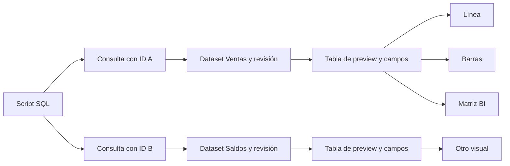

# Autoría visual: automático, builder y ECharts nativo

**Decisión aceptada por el usuario:** 2026-10-07.
**Prioridad de entrega actualizada:** 2026-10-08; ver el
[plan operativo del Studio](sqlviz-studio-delivery-plan.md).
**Alcance ampliado:** 2026-10-08; [AST e inferencia semántica](sqlviz-semantic-inference-architecture.md)
y [matriz ECharts](sqlviz-visual-capability-matrix.md). El objetivo cubre las
23 familias core; GL/plugins requieren verificación separada. No equivale a
soporte entregado ni a inferir cualquier gráfico de cualquier SQL.
**Estado:** diseño para implementar. Este documento no entrega nuevos controles,
datasets persistidos ni un editor experto. Prevalece sobre la exclusión anterior
de opciones nativas en la especificación del Studio.

**Ampliación BI:** la [matriz analítica](sqlviz-analytical-matrix-spec.md) es un
visual central con grilla y medidas por contexto. Su primer flujo entra en S4;
no se confunde con la coordenada `matrix` de ECharts.

## Experiencia y alcance

SQL produce datos; la inferencia propone una visualización; el autor la ajusta.
La experiencia inicial sigue siendo ejecutar una consulta y obtener un gráfico,
sin exigir crear métricas, modelos semánticos o datasets compartidos antes.

| Nivel | Experiencia prevista |
| --- | --- |
| Básico — Automático | Recomendación completa con campos, series y explicación; aceptar o escoger una alternativa |
| Intermedio — Visual Builder | Controles para datos, visual, formato e interacción, con restauración explícita a automático |
| Experto — ECharts native options | Inspeccionar la configuración generada, editar opciones nativas JSON, validar y revisar antes de aplicar |

Los niveles trabajan sobre la misma visualización. Abrir el editor experto no
convierte automáticamente todo el gráfico ni descarta la configuración visual.
Los ajustes se guardan, reabren y representan también en el viewer. La UI revela
opciones avanzadas bajo demanda; no incorpora tres espacios de trabajo obligatorios.

La matriz comparte estos niveles. Su builder organiza Filas/Columnas/Valores con
drag de campos y alternativa por clic; su modo experto usa medidas SQL y JSON
tipado de grilla. ECharts native options continúa siendo el contrato experto de
los gráficos ECharts. No forzar opciones de matriz dentro de `EChartsOption`.

## Motor y contratos

El lienzo usará GridStack y el mapa Drawflow, según la
[decisión de adaptadores](sqlviz-interaction-adapters.md). Los adaptadores internos
ya tienen pruebas; la UI todavía no está conectada. Son motores de interacción:
datasets, visuales, revisiones y el renderer ECharts conservan sus responsabilidades.

Mantener ECharts como motor inicial. Su configuración nativa puede formar parte
del contrato de renderizado; SQLviz conserva identidad, dataset/revisión,
bindings, procedencia de los ajustes, layout y publicación. El Visual Builder
modela las propiedades que sabe editar, sin duplicar toda la gramática del motor.
El contrato existente `VisualSpec` conserva su compatibilidad hasta una migración
explícita; la aceptación de este diseño no cambia su versión ni el archivo `.sqlviz`.

Vega-Lite y Vega son alternativas válidas para describir gráficos. Vega-Lite
compila a Vega; escogerlo para renderizar con ECharts añadiría una traducción que
habría que desarrollar y evaluar. No introducir esa traducción ni otro renderer
de gráficos en esta revisión. La grilla analítica complementa ECharts para
tablas/matrices del producto; no traduce gráficos a Vega. Referencias:
[Vega-Lite](https://vega.github.io/vega-lite/),
[compilación a Vega](https://vega.github.io/vega-lite/usage/compile.html),
[Vega](https://vega.github.io/vega/).

## Identidad y reutilización

Separar cuatro responsabilidades en el modelo objetivo:

| Objeto | Responsabilidad |
| --- | --- |
| Dataset + revisión | Definición de datos: fuente, consulta, esquema, parámetros y granularidad; no confundirlo con el resultado de una ejecución |
| Visualización + revisión | Dataset/bindings, recomendación, ajustes del builder y opciones expertas |
| Panel | Instancia de la visualización dentro de un dashboard, con ID estable, posición y tamaño |
| Dashboard + revisión | Composición, filtros y referencias explícitas a revisiones de visualizaciones |

Una visual puede referenciar varios inputs nombrados por IDs: nodos/enlaces,
precios/volumen, por ejemplo. Dataset no equivale a serie; una tabla puede
alimentar varias series, y una visual puede necesitar varias tablas. El runtime
valida bindings y adapta formas sin exigir otro lenguaje de consultas.

Un dataset puede alimentar varios gráficos sin duplicar su definición. Reutilizar
una visualización no permite que editarla cambie silenciosamente dashboards ya
publicados: sus referencias deben fijar revisiones. Actualizar una referencia
es una acción explícita con preview y validación de dependencias.

Se puede promover una consulta de exploración a dataset reutilizable. Incorporar
su contrato mínimo junto con identidad y persistencia visual antes del recorrido
completo de los tres niveles. La geometría manual puede integrarse primero sobre
referencias estables de paneles existentes; antes de persistirla, garantizar que
editar o reordenar SQL no reasigna su identidad. El catálogo completo, conectores
y métricas gobernadas siguen posteriores; las medidas locales para matriz entran
en S3/S4. Polars, el DAG de transformaciones y la IA no
forman parte de este primer contrato.

## Del editor multiconsulta a campos reutilizables

**Estado observado:** Run ya analiza el script con DuckDB, respetando `;` dentro
de strings/comentarios. Después guarda/ejecuta una sentencia por panel y todavía
asocia por posición (`activePanelIds[i]`). No existe aún el flujo de datasets,
preview de campos y builder completo descrito aquí. S1.1b corrige primero la
identidad/reconciliación; S3 separa consulta/dataset de visual/panel.

Como referencia, Superset distingue SQL Lab, consultas guardadas y datasets para
crear gráficos en Explore; una consulta de SQL Lab debe convertirse en dataset
para ser una fuente persistente de gráficos. Ver
[exploración en Superset](https://superset.apache.org/docs/using-superset/exploring-data/)
y [consultas guardadas frente a datasets](https://superset.apache.org/user-docs/6.1.0/using-superset/using-ai-with-superset/).
Un dataset virtual define SQL ejecutado sobre la fuente; no implica importar sus
filas ni crear una vista física. La fuente y los posibles caches son conceptos
separados: [conexión a datos](https://superset.apache.org/docs/using-superset/creating-your-first-dashboard/),
[SQL de datasets virtuales](https://superset.apache.org/admin-docs/security/).

En SQLviz, conservar el editor con varias sentencias y ofrecer una selección
contextual de consulta/dataset. El diseño previsto es:

1. Analizar y reconciliar los bloques antes de modificar asociaciones. Cada
   consulta tiene ID y nombre de presentación; «Consulta 1» es una etiqueta
   inicial, no su identidad. El orden y los offsets del editor solo ubican texto.
2. Ejecutar la consulta activa o el script. Mostrar resultados por consulta/ID,
   con tabla acotada, esquema/tipos, estado de ejecución y completitud. El esquema
   no se deduce solo de la primera fila y sigue disponible si no hay filas.
3. Crear un gráfico desde ese resultado sin un asistente obligatorio de catálogo.
   La inferencia propone y el builder muestra los campos del dataset seleccionado.
   Guardar/promover a dataset reutilizable conserva SQL, fuente, esquema, parámetros
   y revisión; publicar debe persistir las referencias necesarias, no filas de preview.
4. Seleccionar fecha/categoría/medidas para gráficos, o arrastrar campos a Filas,
   Columnas y Valores para matriz. Usar bindings por ID; cambiar dataset valida
   compatibilidad y no reasigna roles por el orden de columnas.
5. Crear varios visuales sobre el mismo dataset: guardar tres diseños no duplica
   tres definiciones SQL. Cada visual conserva su propia intención y agrupación.
   Cuando proceda, el runtime genera consultas de agregación autorizadas sobre
   la relación completa, no sobre la muestra de preview.
6. Actualizar SQL/esquema mediante una revisión con diagnóstico de dependencias.
   Una ejecución fallida no sustituye el resultado confirmado ni cambia bindings;
   las visuales publicadas no saltan silenciosamente a otra revisión.

La consulta base decide qué campos y granularidad existen. Una salida con solo
`month, total_revenue` no permite elegir `product` ni recuperar transacciones.
El builder explica qué falta y permite volver al SQL. Reagregar un promedio o
ratio requiere componentes suficientes y la semántica de medidas de la matriz;
no basta con `dataset/encode` de ECharts.

`SELECT ...; SELECT ...;` produce dos fuentes de resultado independientes,
no una tabla combinada ni una sola definición de dataset. Una CTE pertenece a
su sentencia; un resultado previo no crea una tabla visible para la siguiente.
Nombres como «Ventas» identifican objetos de UI, no habilitan `FROM Ventas`
automáticamente. Unir datos o encadenar datasets requiere SQL/CTE dentro de una
consulta o referencias explícitas y un adaptador autorizado futuro. No ejecutar
DDL ni crear vistas como efecto lateral de «Guardar dataset».

En editor, los bloques se vinculan mediante metadata y operaciones conscientes
de identidad. Reordenación ambigua, SQL duplicado o pegado de un script completo
requieren preview/resolución de asociaciones; no adivinar por índice o fingerprint.
Pestañas por dataset pueden ofrecer edición enfocada sobre el mismo documento,
sin mantener una segunda copia canónica del SQL. El catálogo de campos sigue el
visual o dataset activo; nunca mezcla resultados de consultas por tener nombres
de columna similares.

El [Mapa del dashboard](sqlviz-dashboard-map-spec.md) será una vista bajo demanda
de ese recorrido real. Se actualiza con las referencias de consultas, datasets,
visuales y paneles; selección y contexto permiten ir al objeto. Distingue draft,
confirmado y linaje analizado, sin ejecutar SQL ni introducir otra fuente de verdad.
Su proyección entra en S3.6 y el primer flujo visible en S4.6; aún no está implementado.

## Cambiar una consulta compartida

**Política prevista, todavía sin implementación:** cambiar el SQL de un dataset
compartido crea una revisión candidata. No borra sus paneles ni reconstruye sus
visuales por defecto. Cada consumidor conserva identidad, geometría y ajustes;
adoptar la revisión requiere validar sus dependencias y mostrar el impacto.

| Cambio | Comportamiento previsto |
| --- | --- |
| Nuevos datos o filtros SQL, con contrato compatible | Recalcular resultados conservando campos, tipo de visual y personalizaciones; mostrar cambios de alcance de los datos |
| Reordenar columnas o agregar un campo | Conservar bindings por ID; el campo nuevo queda disponible, sin agregar series automáticamente |
| Renombrar un campo | Conservar identidad solo con correspondencia validada; una similitud de nombres o linaje es una sugerencia, no autorización para sustituirlo |
| Quitar un campo requerido o cambiar su tipo de forma incompatible | Marcar los consumidores afectados y ofrecer reparación; los demás mantienen su configuración |
| Cambiar granularidad, unidad o significado de una medida | Revisar medidas, agregaciones e interacciones aunque nombres y tipos coincidan; no declarar compatibilidad solo por esquema |
| Resultado vacío | Mostrar estado sin datos manteniendo esquema y bindings; no tratarlo como desaparición de campos |
| Error SQL, timeout o fallo de ejecución | Mantener borrador y último estado confirmado, identificado como previo; no presentarlo como resultado del nuevo SQL |

Por ejemplo, `mes, ingresos, costos` alimenta una línea de ingresos y barras de
costos. Cambiar datos actualiza ambos resultados sin mover paneles ni perder
colores. Quitar `ingresos` exige reparar la línea, pero no las barras. Cambiar de
totales mensuales a diarios requiere revisar el grano incluso si se conserva el
nombre `mes`. Agregar `margen` permite usarlo después; no modifica los dos diseños.

### Revisar y aplicar

1. Editar un borrador sobre una revisión conocida. Construir un plan de impacto
   sobre referencias reales: dataset, visuales, paneles, medidas, filtros y
   opciones expertas dependientes. Mostrar únicamente metadata autorizada.
2. Analizar y, cuando corresponda, ejecutar la candidata para obtener esquema y
   evidencia acotada. Clasificar cada consumidor como compatible, requiere
   revisión, incompatible o no verificado. La ausencia de evidencia semántica no
   equivale a compatibilidad. El linaje profundo se incorpora en S5; antes, los
   cambios de significado no demostrables requieren revisión del autor.
3. Presentar preview y alcance: «Afecta 2 visuales y 2 paneles». Permitir entrar
   al visual afectado para reparar sus campos. La inferencia ofrece alternativas
   para la configuración automática; no reemplaza elecciones manuales ni
   opciones expertas. «Restablecer a automático» sigue siendo explícito y reversible.
4. Confirmar conjuntamente las referencias seleccionadas y sus ajustes válidos.
   En el ejemplo, actualizar ambos es una sola operación: si falta reparar uno,
   no confirmar el otro como efecto parcial. El autor puede elegir explícitamente
   actualizar solo los compatibles; los restantes conservan la revisión anterior
   con ese estado visible. Guardar una candidata no obliga a actualizar todos los
   dashboards que reutilizan el dataset.
5. Verificar revisiones esperadas antes del commit de metadata. Un conflicto
   conserva el borrador y exige revisar el estado vigente. Preparar validación y
   ejecución antes de una transacción corta; no prometer una transacción distribuida
   con la fuente SQL. Confirmar resultados por generación/contexto coherente,
   descartando respuestas tardías. Después de guardar, un refresh fallido muestra
   el resultado anterior con su revisión y frescura, sin atribuirlo a la nueva.

La UI distingue «Modificar consulta compartida» de «Crear una variante para este
panel». La variante conserva el ID y layout del panel, y crea las definiciones
necesarias para separarlo: dataset y también visual si este se reutilizaba. No
duplica filas ni altera los otros consumidores. Ajustar solo título o tamaño
sigue siendo un cambio de instancia, sin crear una variante de datos.

Las publicaciones fijan revisiones de definiciones y referencias; adoptar el SQL
nuevo requiere actualizar/publicar explícitamente. Esto no congela los datos:
refrescar la consulta fijada puede traer filas nuevas. Undo recupera referencias
y configuración, sin prometer restaurar el estado histórico de la fuente.

Cerrar esta política exige pruebas de dos visuales sobre un dataset, una visual
reutilizada en dos paneles, cambios compatibles/incompatibles, resultado vacío,
grano modificado, reparación, adopción selectiva explícita, variante, conflicto,
fallo antes/después del commit, respuestas tardías y publicación fijada. La
persistencia/adopción entra en S3.4a–c y su recorrido de autoría en S4.5.

## Precedencia y edición reversible

La configuración efectiva combina la propuesta aceptada, las elecciones del
builder y las opciones expertas. Las opciones expertas prevalecen en las
propiedades que modifican; la UI identifica su procedencia. SQLviz no mantiene
dos valores efectivos independientes para una misma propiedad.

- Guardar por separado ajustes del builder y ajustes expertos, con versión de
  contrato y compatibilidad del motor declaradas.
- Usar IDs estables para series/componentes. Definir sustitución, eliminación y
  conflicto de listas antes de implementar; un deep merge genérico o posiciones
  de arrays no constituyen una política de edición.
- Conservar personalizaciones al ejecutar, filtrar o recibir recomendaciones.
  Un esquema incompatible produce un diagnóstico; no reasignar campos por orden
  ni restaurar valores sin decisión del autor.
- Los controles que no puedan representar una opción experta explican ese límite
  y conservan la opción. No prometer conversión completa de cualquier configuración
  ECharts a controles visuales.
- Restablecer un ajuste experto revela el valor del builder o automático que
  corresponda. Volver a automático y salir de una configuración experta completa
  son operaciones explícitas, reversibles y con preview.
- Aplicar cambios solo después de validar el conjunto. Un error conserva la
  última visualización confirmada; el borrador inválido sigue editable.

El editor experto comienza con JSON nativo serializable y asistencia de edición.
La política validada debe cubrir propiedades de presentación, encoding, series
e interacciones soportadas, sin reducir este nivel a unos pocos ajustes cosméticos.
La identificación de propiedades no representables y la política de conflictos
son requisitos del contrato que se implementará, no capacidades ya existentes.

Los datos efectivos y su autorización siguen bajo control del runtime de SQLviz;
editar opciones no autoriza otra fuente ni amplía permisos. ECharts permite separar
datos y configuración mediante [dataset y encode](https://echarts.apache.org/handbook/en/concepts/dataset/).
Un JSON válido no basta: validar estructura, capacidades y referencias antes de
guardarlo y renderizarlo. No persistir el resultado de `getOption()` como sustituto
de la intención del autor ni insertar resultados de consultas dentro del documento
de opciones expertas.

Funciones JavaScript y HTML arbitrarios quedan fuera del editor JSON inicial;
no evaluar strings como código. Su futura ejecución requiere una decisión y
aislamiento propios. Procesar opciones con HTML/URLs conforme a la
[guía de seguridad de ECharts](https://echarts.apache.org/handbook/en/best-practices/security/).

Para `custom`, priorizar renderizadores confiables registrados por nombre,
con roles, versión, opciones y presupuestos declarados. ECharts 6 permite esta
referencia mediante `registerCustomSeries`; el autor conserva JSON serializable.
Mapas y otros assets son recursos autorizados/versionados separados de los datos.
Esto amplía la potencia prevista sin prometer ejecutar toda demo arbitraria ni
habilitar callbacks pegados por el usuario. Todavía no hay templates registrados
por SQLviz. Ver [matriz y dependencias](sqlviz-visual-capability-matrix.md).

## Cierre y orden de entrega

Los contratos PATCH de dashboards, campos básicos, presentación y tipo de gráfico
ya tienen incrementos entregados. El [núcleo de geometría](sqlviz-canvas-contract.md)
es S0. Continuar con lienzo persistido y controles (S1), drag/resize (S2), dataset
mínimo y visual (S3), y el primer recorrido de los tres niveles (S4), según el
[plan operativo](sqlviz-studio-delivery-plan.md). Las migraciones y correcciones
de dependencias requeridas acompañan cada entrega. El nivel experto tiene un
primer flujo funcional en S4; no queda al final del acabado.

Para cerrar el nivel experto deben pasar: guardado/reapertura, mismos resultados
en editor/viewer, filtros y refresh sin pérdida de ajustes, precedencia visible,
series reordenadas sin transferir personalizaciones, reset/undo, cambios de esquema
incompatibles, rechazo atómico y validación negativa de contenido no soportado.
Preview y publicación usan la misma revisión y compatibilidad del renderer.

El caso inicial recorre automático → series desde el builder → opciones nativas
para una línea de referencia → guardar → filtrar → reabrir → viewer → reset/undo,
sin pérdida de datos ni configuración. Su evidencia se añadirá al implementarlo.
